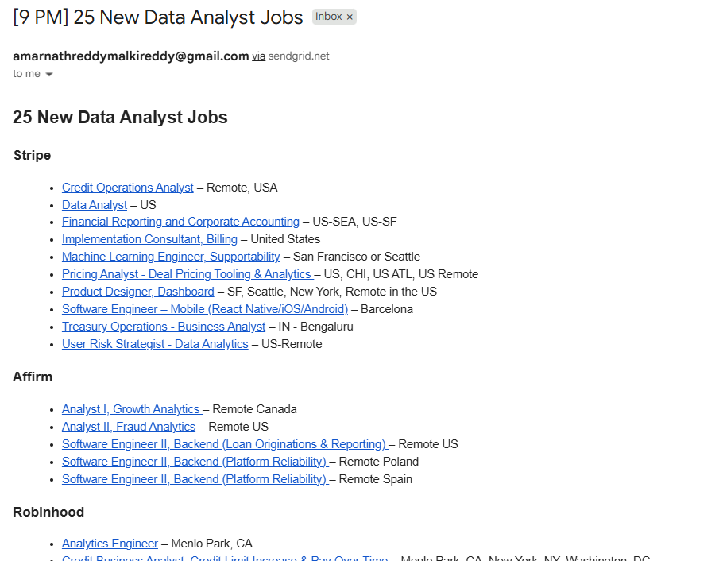

# 📊 US Data Analyst Job Alerts (Entry → Mid)

<p>
  
  
  
  
</p>

**Hourly email digest of new Data Analyst roles** (entry–mid level, US-based, including Remote-US).  
Structured job data pulled directly from **ATS APIs** → filtered → deduplicated → delivered via **SendGrid**.

---

## 🚀 Why this project stands out

- **Signal over noise** → only analyst roles, not engineers/designers/managers  
- **Stable ingestion** → powered by official **ATS JSON APIs** (Greenhouse, Lever, SmartRecruiters), not fragile HTML scraping  
- **Ops-minded** → retries, backoff, 30-day dedup cache, GitHub Actions scheduler  
- **Recruiter-ready** → demonstrates practical automation, reliability, and compliance  

---

## 📬 What the alert looks like

<p align="center">
  
</p>

Each email is grouped by company, with clickable job links and US location info.  
No spam, no duplicates — just new analyst opportunities.

---

## ⚙️ How it works

- Pulls fresh listings from companies in [`companies.json`](./companies.json)  
- Filters for analyst-focused keywords (e.g., *Data Analyst*, *Business Analyst*, *Fraud Analyst*)  
- Excludes senior/lead/manager/engineer/designer roles  
- Keeps only **US or Remote-US** locations  
- Deduplicates jobs with [`.cache/seen_ids.json`](.cache/seen_ids.json)  
- Sends grouped HTML email via SendGrid  
- Runs hourly with GitHub Actions

---

## 📑 Why not LinkedIn / Indeed / Google Jobs?

This project intentionally avoids scraping big job boards or arbitrary portals.

**Reasons:**
1. **Reliability** → job boards are client-rendered and change their HTML frequently; scraping breaks often  
2. **Compliance** → LinkedIn/Indeed explicitly forbid scraping in their Terms of Service  
3. **Data quality** → ATS APIs return structured JSON with consistent fields (title, location, link)  
4. **Performance** → no headless browsers, captchas, or proxies required  
5. **Focus** → we want clear, clean signals for **US-based analyst roles**  

By using **official ATS feeds**, this bot stays stable, lightweight, and recruiter-friendly.

---

## 🔧 Setup (GitHub Actions)

1. **Fork or clone this repo**  
2. **Create a free SendGrid account**  
   - Verify a **single sender** (e.g., your Gmail)  
   - Create an API Key with **Full Access** to Mail Send  
3. **Add GitHub Action secrets** (Repo → Settings → *Secrets and variables* → *Actions*):  
   - `SENDGRID_API_KEY` → your SendGrid key  
   - `SENDER_EMAIL` → verified sender email  
   - `RECIPIENT_EMAIL` → email where alerts should arrive  
4. (Optional) Edit [`companies.json`](./companies.json) to add/remove companies  
5. Trigger manually once: **Actions → Job Alerts (Hourly) → Run workflow**

---

## 🛠 Customize filters

- Adjust keep/deny lists in `job_alerts.py`:
  - `KEYWORDS_POSITIVE_TITLES` → add `"marketing analyst"`, `"operations analyst"`, etc.  
  - `KEYWORDS_NEGATIVE_TITLES` → block `"analytics engineer"`, `"data scientist"`, etc.  
- Location filtering uses regex for **US states** and **Remote-US** markers.  

---

## 🐞 Troubleshooting

<details>
<summary><strong>Got 401 Unauthorized from SendGrid?</strong></summary>  
- Ensure API key is correct and active  
- Confirm `SENDER_EMAIL` is verified in SendGrid  
- Try regenerating the key  
</details>

<details>
<summary><strong>“No new roles this hour”</strong></summary>  
- Normal if nothing new matches filters  
- Add more companies in [`companies.json`](./companies.json)  
- Widen keywords in `job_alerts.py` if desired  
</details>

<details>
<summary><strong>Non-analyst roles slipped in</strong></summary>  
- Add specific phrases to `KEYWORDS_NEGATIVE_TITLES`  
- Example: `"analytics engineer"`, `"data scientist"`  
</details>

---


## ➕ Add more companies

- **Greenhouse**  
  ```json
  { "name": "YourCo", "type": "greenhouse", "board": "yourco" }
---
Built with ❤️ for analysts who want fewer tabs and better signal.
